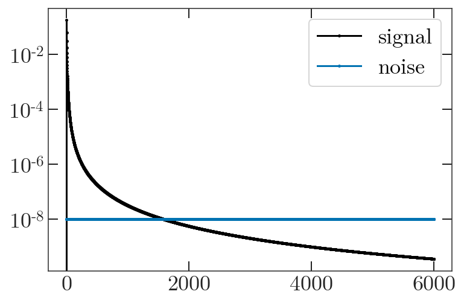

.. _quickstart:

Quickstart
==========

Workflow Tips
-------------
Although this package works perfectly fine on a laptop, you should probably
do your science analysis on the cluster. A set of four standard ACT resolution
split maps takes ~5 minutes to cook into spectra on a 40-core tiger node. The
same on your laptop would take more than three hours!

Some clusters have Jupyter support, but we've found it nice to run this
quickstart tutorial with `ipython`. You might need to install it to your conda
environment.

.. code:: bash

  conda install ipython -n YOUR_ENV_NAME

To get your plots to appear on your laptop, make sure to tunnel in with `ssh -Y`.

NaMaster also depends on the environmental variable `OMP_NUM_THREADS` to
determine how many threads to run in parallel. On tiger, I run

.. code:: bash

  export OMP_NUM_THREADS=40

before running any code. You should set this, with the number corresponding to
the number of cores on your machine.

Simulated Maps
--------------

In this example, we generate some fake spectra plagued by bright point sources.
We then mask those sources and generate spectra which have been corrected for
the mode coupling induced by our mask. This example is also available as a
`Jupyter notebook`_.

We start by importing our libraries.

.. code:: python

  import nawrapper as nw
  import pymaster as nmt
  import numpy as np
  import matplotlib.pyplot as plt
  from pixell import enmap, enplot

Next, we generate a random map realization for the spectrum
:math:`C_{\ell} = \ell^{-2.5}`.

.. code:: python

  # map information
  shape,wcs = enmap.geometry(shape=(1024,1024),
      res=np.deg2rad(0.5/60.),pos=(0,0))

  # create power spectrum information
  ells = np.arange(0,6000,1)
  ps = np.zeros(len(ells))
  ps[2:] = 1/ells[2:]**2.5 # don't want monopole/dipole

  # generate a realization
  imap = enmap.rand_map(shape,wcs,ps[np.newaxis, np.newaxis])
  plt.imshow(imap)

Next, we generate a fake point source map and a matching source mask.

.. code:: python

  mask = enmap.ones(imap.shape, imap.wcs)

  N_point_sources = 50
  for i in range(N_point_sources):
      mask[
          np.random.randint(low=0, high=mask.shape[0]),
          np.random.randint(low=0, high=mask.shape[1]) ] = 0
  # apodize the pixels to make fake sources
  point_source_map = 1-nw.apod_C2(mask, 0.1)

  imap += point_source_map # add our sources to the map
  mask = nw.apod_C2(mask, 0.5) # apodize the mask

  # plot our cool results
  fig, axes = plt.subplots(1, 2, figsize=(8,16))
  axes[0].imshow(imap)
  axes[1].imshow(mask)

For additional realism we generate noise power spectra to add to our "splits".

.. code:: python

  ells = np.arange(0,len(ps),1)
  nl = np.ones(len(ells)) * 1e-8

  noise_map_1 = enmap.rand_map(shape,wcs,nl[np.newaxis, np.newaxis])
  noise_map_2 = enmap.rand_map(shape,wcs,nl[np.newaxis, np.newaxis])

  plt.plot(ps, label="ps")
  plt.plot(nl, label="noise")
  plt.yscale('log')
  plt.legend()

For this example, we won't include a beam. Now we set up the
:py:class:`nawrapper.ps.namap_car` objects, using as input our
our original random realization summed with the noise realizations.

.. code:: python

  namap_1 = nw.namap_car(maps=imap + noise_map_1, masks=mask)
  namap_2 = nw.namap_car(maps=imap + noise_map_2, masks=mask)

Next we compute the mode-coupling matrix. We need the binning file, which
we have in the `repository`_ under `notebooks/data/`. You'll need to point it to
the right path on your own installation. This is the slow part, you might want
to get a snack while you wait (about 5 minutes on 1 core for a map of this
size).

.. code:: python

  binfile = 'data/BIN_ACTPOL_50_4_SC_low_ell'
  bins = nw.read_bins(binfile)
  mc = nw.mode_coupling(namap_1, namap_2, bins)

Finally, we can compute some spectra! Pass in the namaps we created, with the
mode coupling object.

.. code:: python

  Cb = nw.compute_spectra(namap_1, namap_2, mc=mc)

Let's plot it!

.. code:: python

  plt.plot(ps, 'k-', label='input')
  plt.plot(Cb['ell'], Cb['TT'], 'r.', label='computed')
  plt.legend()
  plt.yscale('log')

.. figure:: ../_static/result_ps.png
  :scale: 60%

We've recovered our input spectrum!

.. _repository: https://github.com/xzackli/nawrapper/tree/master/notebooks/data
.. _Jupyter notebook: https://github.com/xzackli/nawrapper/blob/master/notebooks/Getting%20Started.ipynb
