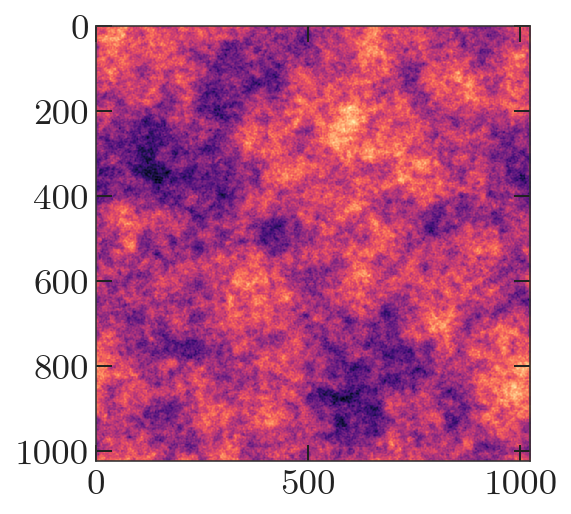
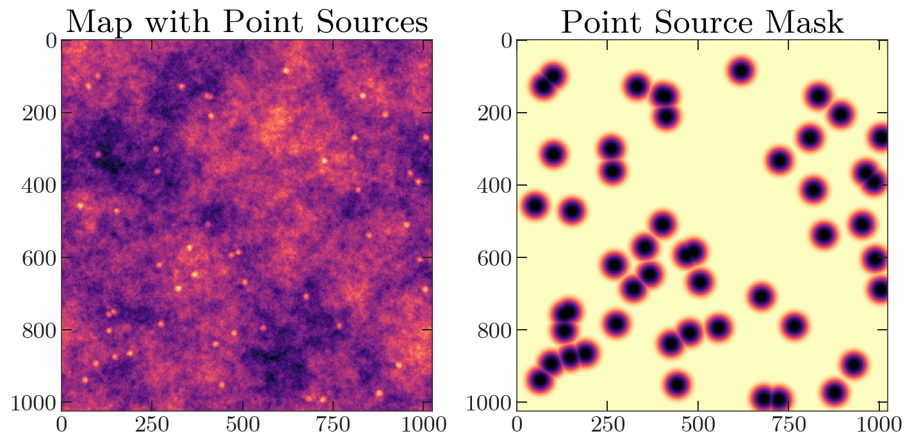
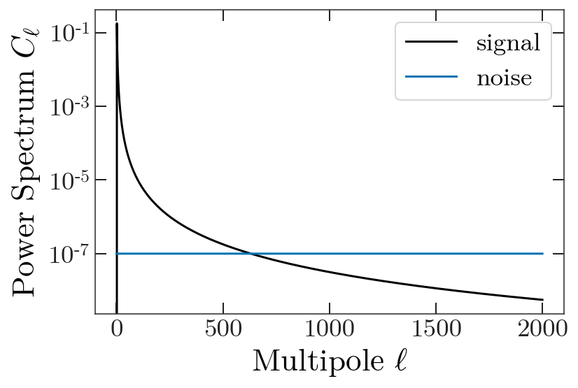
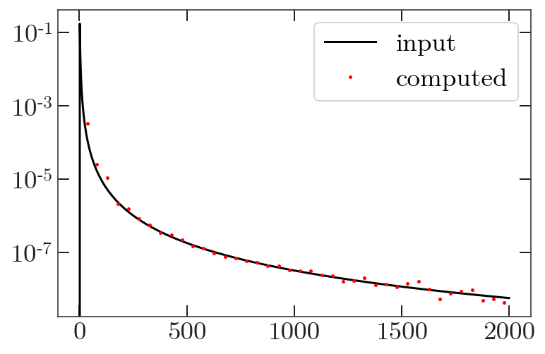

.. _quickstart:

Getting Started
===============

In this example, we generate some fake spectra plagued by bright point
sources. We then mask those sources and generate spectra which have been
corrected for the mode coupling induced by our mask.

We start by importing our libraries.

.. code:: python

    import pymaster as nmt
    import numpy as np
    import matplotlib.pyplot as plt
    from pixell import enmap, enplot
    
    import nawrapper as nw
    import nawrapper.maptools as maptools

Let's generate a random map to try doing analysis on. Next, we generate
a random map realization for the spectrum
:math:`C_{\ell} = \ell^{-2.5}`. We'll use a 2 arcminute pixel to make
this fast.

.. code:: python

    shape,wcs = enmap.geometry(shape=(1024,1024),
                               res=np.deg2rad(2/60.),pos=(0,0))
    ells = np.arange(0,2000,1)
    ps = np.zeros(len(ells))
    ps[2:] = 1/ells[2:]**2.5 # don't want monopole/dipole
    imap = enmap.rand_map(shape,wcs,ps[np.newaxis,np.newaxis])
    plt.imshow(imap)

Next, let's generate a point source map. We'll add these sources to the
map, and apodize to generate a mask.

.. code:: python

    mask = enmap.ones(imap.shape, imap.wcs)
    
    N_point_sources = 50
    for i in range(N_point_sources):
        mask[ 
            np.random.randint(low=0, high=mask.shape[0]), 
            np.random.randint(low=0, high=mask.shape[1]) ] = 0
    point_source_map = 1 - maptools.apod_C2(mask, 0.5)
    imap += point_source_map
    mask = maptools.apod_C2(mask, 2)
    
    fig, axes = plt.subplots(1, 2, figsize=(10,20))
    axes[0].imshow(imap)
    axes[1].imshow(mask)
    axes[0].set_title('Map with Point Sources')
    axes[1].set_title('Point Source Mask')
    plt.tight_layout()

For additional realism we generate noise power spectra to add to our
“splits”.

.. code:: python

    ells = np.arange(0,len(ps),1)
    nl = np.ones(len(ells)) * 1e-7
    
    plt.figure(figsize=(6,4))
    plt.plot(ps, "-", label="signal")
    plt.plot(nl, "-", label="noise")
    plt.yscale('log')
    plt.legend()
    plt.ylabel(r'Power Spectrum $C_{\ell}$')
    plt.xlabel(r'Multipole $\ell$')

.. code:: python

    noise_map_1 = enmap.rand_map(shape, wcs,
                                 nl[np.newaxis, np.newaxis])
    noise_map_2 = enmap.rand_map(shape, wcs,
                                 nl[np.newaxis, np.newaxis])

For this example, we won’t include a beam. Now we set up the
:py:class:`nawrapper.ps.namap_car` objects, using as input our our original random
realization summed with the noise realizations.

The Power Spectrum Part
-----------------------

.. code:: python

    namap_1 = nw.namap_car(maps=(imap + noise_map_1, None, None), masks=mask)
    namap_2 = nw.namap_car(maps=(imap + noise_map_2, None, None), masks=mask)

This will print some diagnostic information by default.
.. parsed-literal::

    Assuming the same mask for both I and QU.
    Creating a car namap. temperature: True, polarization: False
    temperature beam not specified, setting temperature beam to 1.
    Applying a k-space filter (kx=0, ky=0, apo=40), unpixwin: True
    Computing spherical harmonics.
    
    Assuming the same mask for both I and QU.
    Creating a car namap. temperature: True, polarization: False
    temperature beam not specified, setting temperature beam to 1.
    Applying a k-space filter (kx=0, ky=0, apo=40), unpixwin: True
    Computing spherical harmonics.
    

Now let's compute the mode coupling matrix. First we need to set up a
binning object. The easiest way to do this is ``create_binning`` from
nawrapper, which takes a function for the weights and either a list of
bin widths for ``widths=`` or an integer (in which case all bins will
have the same width).

You can load this from file (see ``nw.read_bins``))

.. code:: python

    # 40 bins of width 50 and 50 bins of width 100
    # lmax cuts off the end bins, so nothing over 1000 is included
    bins = nw.create_binning(lmax=2000, lmin=2, 
                             widths=[50]*40 + [100]*50, 
                             weight_function=(lambda ell : ell**2))

We associate a mode-coupling object with a directory. Here, we specify a
relative path. The mode-coupling object will write the matrices to disk
when it is done computing. Future runs will look at the specified path
for precomputed mode-coupling matrices, and read them in if they exist.
To recompute matrices, specify the argument ``overwrite=True``.

.. code:: python

    mc = nw.mode_coupling(namap_1, namap_2, bins, mcm_dir='./quickstart_mcm/', overwrite=True)

.. parsed-literal::

    Computing new mode-coupling matrices.
    Saving mode-coupling matrices to ./quickstart_mcm/

Finally, we can compute some spectra!

.. code:: python

    Cb = nw.compute_spectra(namap_1, namap_2, mc=mc)
    print(Cb.keys())

.. parsed-literal::

    dict_keys(['TT', 'ell'])

Let’s plot it!

.. code:: python

    plt.plot(ps, 'k-', label='input')
    plt.plot(Cb['ell'], Cb['TT'], 'r.', label='computed')
    plt.legend()
    plt.yscale('log')

