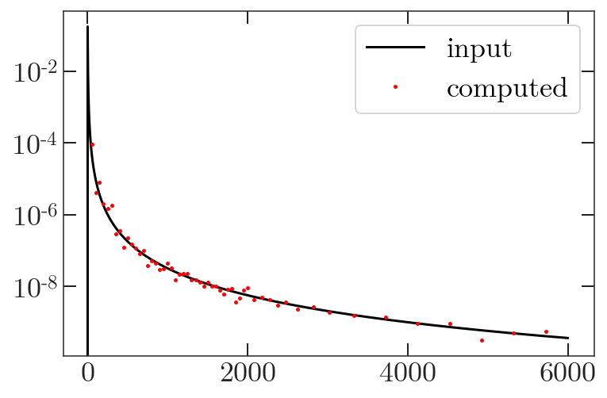

Quickstart
==========

Simulated Maps
-------------------------

We start by importing our libraries.

.. code:: python

  import nawrapper.ps as nw
  import pymaster as nmt
  import numpy as np
  import matplotlib.pyplot as plt
  from pixell import enmap, enplot

Next, we generate a random map realization for the spectrum
:math:`C_{\ell} = \ell^{-2.5}`.

.. code:: python

  # map information
  shape,wcs = enmap.geometry(shape=(1024,1024),
      res=np.deg2rad(0.5/60.),pos=(0,0))

  # create power spectrum information
  ells = np.arange(0,6000,1)
  ps = np.zeros(len(ells))
  ps[1:] = 1/ells[1:]**2.5

  # generate a realization
  imap = enmap.rand_map(shape,wcs,ps[None,None])
  plt.imshow(imap)

.. figure:: ../_static/randomlygeneratedmap.png
  :scale: 60%

Next, we generate a fake point source map and a matching source mask.

.. code:: python

  mask = enmap.ones(imap.shape, imap.wcs)

  N_point_sources = 50
  for i in range(N_point_sources):
      mask[
          np.random.randint(low=0, high=mask.shape[0]),
          np.random.randint(low=0, high=mask.shape[1]) ] = 0
  # apodize the pixels to make fake sources
  point_source_map = 1-nw.apod_C2(mask, 0.1)

  imap += point_source_map # add our sources to the map
  mask = nw.apod_C2(mask, 0.5) # apodize the mask

  # plot our cool results
  fig, axes = plt.subplots(1, 2, figsize=(8,16))
  axes[0].imshow(imap)
  axes[1].imshow(mask)

.. figure:: ../_static/random_point_sources.png

For additional realism we generate noise power spectra to add to our "splits".

.. code:: python

  ells = np.arange(0,len(ps),1)
  nl = np.ones(len(ells)) * 1e-8

  noise_map_1 = enmap.rand_map(shape,wcs,nl[None,None])
  noise_map_2 = enmap.rand_map(shape,wcs,nl[None,None])

  plt.plot(ps, label="ps")
  plt.plot(nl, label="noise")
  plt.yscale('log')
  plt.legend()

.. figure:: ../_static/noise_power.png
  :scale: 60%

For this example, we won't include a beam. Now we set up the namap objects,
adding our original random map to the noise realization.

.. code:: python

  namap_1 = nw.namap(map_I=imap + noise_map_1, mask=mask)
  namap_2 = nw.namap(map_I=imap + noise_map_2, mask=mask)

Next we compute the mode-coupling matrix. We need the binning file, which
we store in `notebooks/data/`. You'll need to point it to the right path on
your own installation.

.. code:: python

  binfile = 'data/BIN_ACTPOL_50_4_SC_low_ell'
  bins = nw.read_bins(binfile)
  mc = nw.mode_coupling(namap_1, namap_2, bins)

Finally, we can compute some spectra! Pass in the namaps we created, with the
mode coupling object.

.. code:: python

  Cb = nw.compute_spectra(namap_1, namap_2, mc=mc)

We've recovered our input spectrum!
